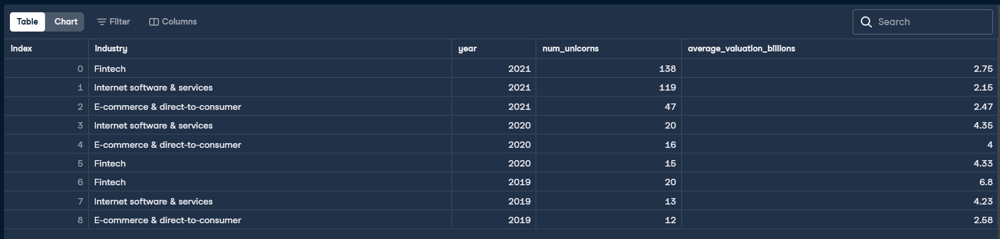

# 🦄 Unicorn Industry Analysis (SQL)

## 📖 Business Problem

A venture capital firm wants to identify the industries that generated the highest number of unicorn companies between 2019 and 2021. The objective is to analyze industry performance by counting new unicorn companies each year and calculating their average valuation in billions of U.S. dollars to support future investment decisions.

---

## 📊 Final Query Output

> *(Insert the screenshot of your final SQL query result here)*



---

## 📂 Dataset

The analysis was performed using the following tables:

- `companies`
- `industries`
- `dates`
- `funding`

Main fields used:

- company_id
- industry
- date_joined
- valuation

---

## 🎯 Project Objectives

- Identify the three industries with the highest number of unicorn companies between 2019 and 2021.
- Count the number of unicorn companies created each year.
- Calculate the average company valuation.
- Convert valuations into billions of U.S. dollars.
- Present the results ordered by year and number of unicorns.

---

## 🛠 SQL Skills Demonstrated

- Common Table Expressions (CTEs)
- INNER JOIN
- Aggregate Functions (`COUNT`, `AVG`)
- Date Functions (`EXTRACT`)
- Data Transformation
- Numeric Calculations
- GROUP BY
- ORDER BY
- LIMIT
- Business Analytics

---

## 💡 Solution

The solution is divided into two Common Table Expressions (CTEs).

The first CTE identifies the three industries with the highest number of unicorn companies created between 2019 and 2021.

The second CTE combines company, industry, funding, and date information to calculate the yearly number of unicorn companies and their average valuation. Company valuations are converted from dollars to billions of dollars and rounded to two decimal places before generating the final report.

---

## 📈 Business Insights

This analysis helps identify which industries experienced the greatest growth in unicorn creation during the selected period. By combining the number of unicorns with their average valuation, investors can better understand where high-growth opportunities emerged and compare the relative strength of different sectors.

---

## 📚 Key Learnings

Through this project I strengthened my understanding of:

- Common Table Expressions (CTEs)
- Multi-table JOINs
- Aggregate Functions
- Date manipulation using `EXTRACT()`
- Data transformation and unit conversion
- Query organization using multiple logical steps
- Writing SQL solutions for real business scenarios

---

## 📁 Repository Structure

```
unicorn-industry-analysis-sql
│
├── README.md
├── unicorn_industry_analysis.sql
└── final_result.png
```
